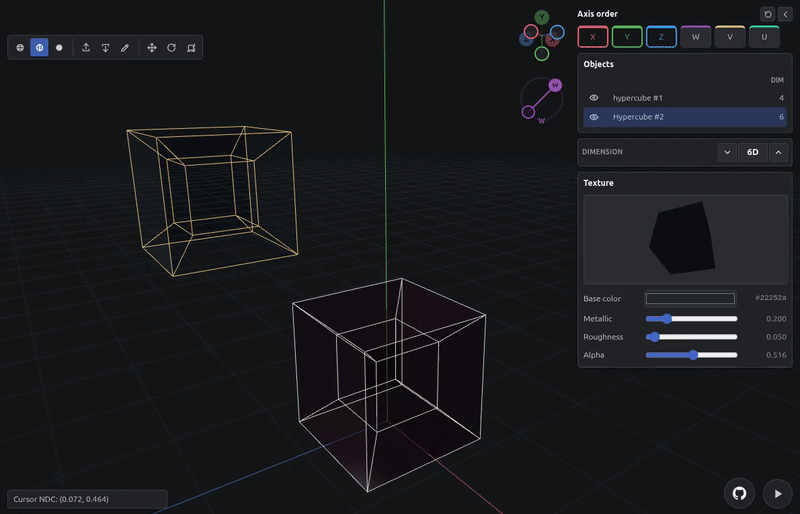

<picture>
  <source media="(prefers-color-scheme: dark)" srcset="public/logo_dark.png">
  <source media="(prefers-color-scheme: light)" srcset="public/logo_light.png">
  
</picture>

# Polyple

[Polyple](https://polyple.xyz/) is an interactive N-dimensional geometry editor and renderer built with **Three.js**. It lets you create high-dimensional objects, project them into 3D, edit their cells, animate projection/camera state, and share exact scenes through compact saved URLs.



Live demo: https://polyple.xyz/

## Features

- N-dimensional primitive library: plane, hypercube, spiked hypercube, cross polytope, spiked cross, simplex, spiked simplex, simplex prism, spiked simplex prism, demicube, spiked demicube, 24-cell, spiked 24-cell, duoprism, and spiked duoprism
- Projection controls for choosing projected axes, reordering extra axes, toggling depth perspective per axis, and auto-rotating extra dimensions
- Object workflow with multiple meshes, multi-select, visibility toggles, rename/delete, duplication, and transform gizmos
- Edit mode with selectable vertices, edges, faces, volumes, and higher-dimensional cells when topology is available
- Cell editing operations: move, rotate, scale, delete, extrude, inset, edge bevel, vertex bevel, inward bevel, grouped operation mode, and individual operation mode
- Shared material slots with per-object assignment, material splitting, renaming, standard material controls, emissive controls, and PBR glass controls
- Scene lighting with user-created point and directional lights, selectable light objects, transform support, directional handles, shadows, and an environment-light toggle
- Environment controls for plain color backgrounds and HDRI backgrounds with quality, blur, and brightness settings
- Render modes for wireframe, solid, and faceted surfaces
- Render effects: bloom, motion blur, color hue/saturation/brightness/contrast, antialias mode, and throttled film grain
- Timeline animation with keyframes for projection, camera, render mode, effects, object state, and lights
- Render/export tools for animation video, live viewport recording, screenshots, camera frame size, FPS, frame count, and render quality tiers
- Undo/redo and compact scene save/load through generated URLs or saved text files
- Mobile fullscreen toggle and mobile-friendly transform controls

## Quick Start

Requirements:

- Node.js 18+

Install and run locally:

```bash
npm install
npm run dev
```

Build and preview the production bundle:

```bash
npm run build
npm run preview
```

## UI Map

- **Projection Controls**: the upper-left gizmo dock. It contains the dimension selector, XYZ axis gizmo, axis-cycle/reset/focus controls, and extra-axis gizmos.
- **Scene Controls**: the right-side panel. It contains the object list, undo/redo, scene save/load, and category tabs.
- **Environment Tab**: background color/HDRI, HDRI quality, environment lighting, background blur, and background brightness.
- **Lights Tab**: point/directional light selection, light type switching, color, intensity, shadow toggle, and delete.
- **Render Tab**: FPS, frame count, camera size, render quality, video render, viewport recording, screenshot capture, and render effects.
- **Texture Tab**: material selector, material usage count, split-material button, material name, standard/glass controls, emissive controls, and live material preview.
- **Viewport Mode Controls**: bottom-left wireframe/rendered/faceted mode buttons.
- **Timeline Controls**: bottom timeline with previous-frame, play/pause, next-frame, scrubber, and keyframe markers.
- **Transformation Controls**: bottom circular controls for edit mode, move, rotate, scale, and edit operations.
- **Cell Dimension Buttons**: shown above transform controls in edit mode; select vertex/edge/face/volume/higher-cell selection levels.

## Camera And Projection

- Left mouse drag: orbit the camera
- Mouse wheel: zoom
- <kbd>←</kbd> / <kbd>→</kbd> / <kbd>↑</kbd> / <kbd>↓</kbd>: orbit the camera
- <kbd>Ctrl</kbd> + <kbd>↑</kbd>/<kbd>↓</kbd>: keyboard zoom
- Middle mouse drag: cycle the projected XYZ axes
- XYZ gizmo drag: orbit the camera
- XYZ endpoint click: snap the camera to that axis direction
- <kbd>+</kbd> / <kbd>-</kbd>: increase or decrease the dimension used for newly created primitives
- Dimension buttons: set the new primitive dimension directly
- Shift axes button: cycle which dimensions project into XYZ
- Reset rotations button: reset extra-axis rotations
- Recenter camera button: restore the default camera distance/orbit
- Reset focus button: return the camera focus to the world origin
- Extra-axis gizmo drag: rotate global N-D space around that extra dimension's projection plane
- Extra-axis play button: cycle that axis auto-rotation through speed levels, then stop
- Extra-axis depth button: include or exclude that axis from perspective depth
- Extra-axis handle drag: reorder extra axes
- Drag an extra-axis gizmo over an XYZ tip: swap that extra axis with the highlighted projected axis
- <kbd>P</kbd>: toggle extra-axis auto-rotation playback

## Objects

- <kbd>Shift</kbd> + <kbd>A</kbd>: open the add menu at the pointer
- Right click empty viewport: open the add/keyframe context menu
- Add menu: create primitives or lights at the pointer plane
- Click object: select object
- <kbd>Shift</kbd> + click object: add/remove object from multi-selection
- Double click object: focus camera on it
- Object list: select, multi-select, rename, hide/show, and manage objects
- <kbd>Shift</kbd> + <kbd>D</kbd>: duplicate selected object and place it with the mouse
- <kbd>X</kbd>: delete selected object, or confirm deletion if the delete confirmation is already open
- Left click during placement/operation: commit
- Right click during placement/operation: cancel without opening the context menu

## Transforms

- <kbd>G</kbd>: move selected objects or selected edit cells
- <kbd>R</kbd>: rotate selected objects or selected edit cells
- <kbd>S</kbd>: scale selected objects or selected edit cells
- Transform buttons: toggle move, rotate, or scale from the viewport UI
- Transform gizmo handles: start constrained transforms on projected or extra axes
- <kbd>X</kbd> / <kbd>Y</kbd> / <kbd>Z</kbd> / <kbd>W</kbd> / <kbd>V</kbd> / <kbd>U</kbd> / <kbd>T</kbd> / <kbd>S</kbd> during an active transform: lock to the corresponding object axis when available
- Press a projected-axis lock key twice during a transform: switch from global projected-axis lock to local-axis lock for that dimension
- <kbd>Ctrl</kbd> during move/scale: snap to integer coordinates
- <kbd>Ctrl</kbd> during rotate: snap to 30-degree steps
- Left click: commit active transform
- Right click, pointer cancel, or window blur: cancel active transform
- Pointer-lock operations show a small wrapping drag indicator so long drags can continue past screen edges

## Edit Mode

- <kbd>Tab</kbd>: toggle edit mode
- <kbd>1</kbd>: vertex selection
- <kbd>2</kbd>: edge selection
- <kbd>3</kbd>: face selection
- <kbd>4</kbd>: volume selection
- <kbd>5</kbd>-<kbd>8</kbd>: higher-dimensional cell selection when available
- Cell dimension buttons: switch the active edit selection dimension
- Click edit element: select cell under the pointer
- <kbd>Shift</kbd> + click edit element: add/remove cells from the selection
- <kbd>Alt</kbd> + click overlapping edit elements: cycle through candidates at the pointer
- <kbd>Ctrl</kbd> + <kbd>A</kbd> in edit mode: select all cells in the active edit dimension
- <kbd>X</kbd> in edit mode: delete the selected cell(s) with pruning and vertex compaction
- Edit mode changes the viewport background to the default edit background for contrast

## Edit Operations

- <kbd>E</kbd>: extrude selected edit cells
- <kbd>I</kbd>: inset selected edit cells
- <kbd>B</kbd>: edge bevel selected edit cells
- <kbd>Shift</kbd> + <kbd>B</kbd>: vertex bevel selected edit cells
- <kbd>Alt</kbd> + <kbd>B</kbd>: inward edge bevel
- <kbd>Alt</kbd> + <kbd>Shift</kbd> + <kbd>B</kbd>: inward vertex bevel
- Edit operation buttons: bevel, inset, and extrude beside the transform controls in edit mode
- Mouse movement controls operation amount; moving in the opposite direction can produce negative extrusion where supported
- Mouse wheel during bevel: increase/decrease bevel smoothness level
- Press the same operation key/button again while that operation is active: switch to individual-cell mode
- Press another operation shortcut while an operation is active: cancel the current operation and start the new one
- Adjacent selected cells default to grouped operation behavior; repeated operation activation switches to individual behavior
- Left click: commit operation and write undo/history state
- Right click, pointer cancel, or window blur: cancel operation and restore the previous topology

## Materials

- Texture tab is always available, even when no object is selected
- Material dropdown lists all scene materials currently held by objects
- Material count shows how many objects use the selected material
- Split material button makes the selected object use an independent material copy
- Name field renames the selected material slot
- Editing a shared material updates every object using that material
- Standard material controls: base color, metalness, roughness, alpha, emissive color, and emissive intensity
- Glass material controls: base color, alpha, roughness, transmission, IOR, thickness, attenuation color/distance, clearcoat, clearcoat roughness, specular intensity, emissive color, and emissive intensity
- Material preview uses a generated backdrop/floor only inside the preview so glass and reflection settings are visible

## Lights And Environment

- Lights are scene objects and can be selected, moved, duplicated, deleted, and keyframed
- Add menu can create point lights and directional lights
- Lights tab switches the selected light between point and directional type
- Directional lights expose a viewport handle for direction control
- Environment tab can use a plain color or one of the built-in HDRI backgrounds
- Background color picker controls the plain background color
- Environment lighting toggle enables/disables scene illumination from the environment
- HDRI quality controls switch background assets between SD/HD variants
- Background blur and brightness tune the environment backdrop

## Rendering And Animation

- <kbd>1</kbd> / <kbd>2</kbd> / <kbd>3</kbd> outside edit mode: switch wireframe, rendered, or faceted viewport mode
- Viewport mode buttons: switch wireframe/rendered/faceted mode
- <kbd>Space</kbd>: play/pause timeline preview
- Previous / Play / Next timeline buttons: step or play the animation
- Timeline scrubber: seek frame
- Right click timeline or canvas: add/remove keyframes from the keyframe menu
- <kbd>I</kbd> outside edit mode: insert a keyframe at the current frame
- <kbd>U</kbd> outside edit mode: remove the last keyframe at or before the current frame
- Render tab: set FPS, frame count, camera output size, render quality, and render effects
- <kbd>Ctrl</kbd> + <kbd>Shift</kbd> + <kbd>E</kbd>: render the animation as video
- <kbd>Shift</kbd> + <kbd>R</kbd>: start/stop live viewport recording
- <kbd>Shift</kbd> + <kbd>S</kbd>: download a screenshot of the current frame
- <kbd>Ctrl</kbd> + <kbd>Shift</kbd> + <kbd>D</kbd>: show/hide FPS and frame-time overlay

## History And Scene Files

- <kbd>Ctrl</kbd> + <kbd>Z</kbd> / <kbd>Cmd</kbd> + <kbd>Z</kbd>: undo
- <kbd>Ctrl</kbd> + <kbd>Y</kbd> / <kbd>Cmd</kbd> + <kbd>Y</kbd>: redo
- <kbd>Ctrl</kbd> + <kbd>Shift</kbd> + <kbd>Z</kbd> / <kbd>Cmd</kbd> + <kbd>Shift</kbd> + <kbd>Z</kbd>: redo
- Undo/redo uses compact scene state snapshots for committed operations
- Save button: generate the compact scene string, download it as a text file, and copy the shareable URL to the clipboard
- Load button: load a saved scene text file
- Opening a saved scene URL recreates the exact scene, then restores the browser URL back to the app route after loading
