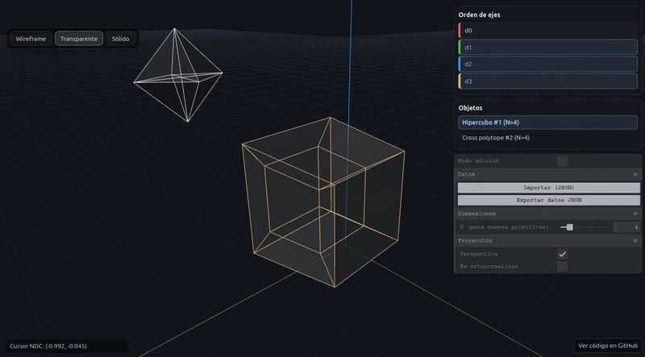

# ND-Viewer

`ND-Viewer` is an interactive N-dimensional geometry viewer built with Three.js and Tweakpane.


It lets you create, inspect, transform, and edit high-dimensional objects, then project them into 3D for visualization. The project supports hypercubes, simplexes, cross polytopes, simplex prisms, custom JSON data, canonical projection, PCA projection, N-D rotation, vertex editing, and undo/redo.

Live demo:

https://srdz-af.github.io/nd-viewer/

## Usage

ND-Viewer supports:

1. Interactive creation of N-dimensional polytopes.
2. Projection from N dimensions into 3D.
3. Canonical projection using selected axes.
4. PCA projection from object data.
5. Object movement, rotation, and scaling.
6. Higher-dimensional rotation using W rotation.
7. Vertex-level editing in N-dimensional space.
8. JSON import and export.
9. Undo and redo for key editing operations.
10. Multiple display modes for the same geometry.

## Supported objects

You can create these objects from the context menu or with `Shift + A`:

1. Hypercube.
2. Cross polytope.
3. Simplex.
4. Simplex prism.

Each object owns its own vertices, edges, faces, and transform state. This makes it possible to instantiate, edit, select, and delete objects independently.

## Core idea

Internally, the viewer stores object coordinates in up to 8 dimensions.

When you create a primitive with fewer dimensions, the viewer embeds its coordinates into the internal 8D representation. The unused dimensions stay at zero.

The renderer then projects the selected dimensions into 3D. You can change which dimensions appear as X, Y, and Z, or let PCA choose a projection based on the data.

## Projection modes

### Canonical projection

Canonical projection maps three selected dimensions directly into the visible 3D axes.

For example:

```text
d0 -> X
d1 -> Y
d2 -> Z
```

You can reorder the axis list in the control panel. The first three dimensions in that order define the visible projection.

You can also drag with the middle mouse button to cycle through projected dimension triples.

### PCA projection

PCA projection computes a 3 by N projection matrix from the object data.

This helps when the interesting structure is spread across several dimensions instead of being visible from a fixed axis selection.

## Interaction model

ND-Viewer behaves like a small modeling tool for high-dimensional objects.

Camera controls use OrbitControls:

```text
Left mouse button: orbit
Mouse wheel: zoom
Middle mouse button drag: cycle projected dimensions
```

Object controls:

```text
G: move
R: rotate
S: scale
X, Y, Z: lock transform to the projected axis
W during rotation: rotate through the last N-D dimension
Left click: confirm transform
Right click: cancel transform
```

Editing controls:

```text
Tab: toggle edit mode
Left click vertex: select vertex
Right click vertex: open vertex transform menu
Ctrl+Z or Cmd+Z: undo
Ctrl+Y or Cmd+Y: redo
```

## N-D transformations

Object transforms happen through the current 3D projection, but they update the underlying N-dimensional data.

Movement updates the selected projected dimensions.

Rotation supports normal projected-space rotation and W rotation. W rotation mixes one projected dimension with the last active N-dimensional axis. This makes the object appear to turn through a higher dimension instead of only spinning in visible 3D space.

Vertex editing works the same way. When you move a vertex, the viewer updates its N-dimensional coordinates, recomputes affected geometry, and redraws the object.

## Display modes

The viewer supports three display modes:

1. Wireframe.
2. Transparent.
3. Solid.

The selected mode applies to the base object and its instances.

Wireframe is useful for structure. Transparent mode helps you see faces and depth at the same time. Solid mode gives a cleaner view when you care about the final shape.

## JSON import and export

ND-Viewer can load external geometry from JSON.

Example format:

```json
{
  "points": [
    { "d0": 0.0, "d1": 0.5, "d2": -0.5 },
    { "d0": 1.0, "d1": 0.5, "d2": 0.0 }
  ],
  "edges": [
    [0, 1]
  ],
  "adjacency": {
    "0": [1],
    "1": [0]
  }
}
```

`points` can use arrays or objects with dimension keys.

`edges` and `adjacency` are optional, but at least one of them should exist if you want real connectivity.

When you import JSON, the viewer replaces the current base object with the imported object and clears existing instances.

## Undo and redo

The viewer stores snapshots for key state changes.

Snapshots include:

1. Active dimension count.
2. Point matrix.
3. Number of points.
4. Projected axes.
5. Object position.
6. Object rotation.
7. Object scale.
